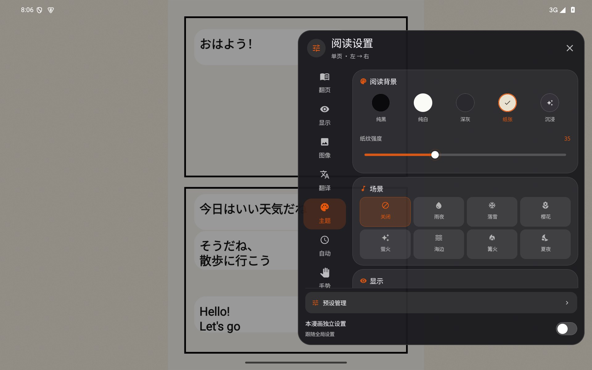

<div align="center">


# Ciallo Reader

**Android 阅读器 / 在线书库聚合下载器**

Kotlin · Jetpack Compose (Material 3) · MVVM · 单 Activity

[下载 1.2.8 APK](https://github.com/roxycon-dev/Ciallo-Reader/releases/download/v1.2.8/Ciallo-Reader-v1.2.8.apk) ·
[功能](#功能) ·
[安装](#安装) ·
[使用说明](#使用说明) ·
[FAQ](#faq) ·
[提交 Issue](https://github.com/roxycon-dev/Ciallo-Reader/issues)


</div>

***

## 简介

Android 端小说 / 漫画阅读器，内置多书源在线聚合搜索与下载：本地阅读、在线找书、离线管理一体化，搜到的书可以直接下载到书架离线看。

| 项目                     | 内容                                                                  |
| ---------------------- | ------------------------------------------------------------------- |
| 当前版本                   | 1.2.8                                                               |
| 开发状态                   | 个人项目 · 活跃开发中                                                        |
| 最低系统                   | Android 7.0（API 24）                                                 |
| compileSdk / targetSdk | 35                                                                  |
| 技术栈                    | Kotlin 2.0 + Jetpack Compose（Material 3）+ MVVM + Room + WorkManager |
| 架构                     | MVVM + StateFlow + Repository，单 Activity + Navigation Compose       |
| 测试 | 764 项 JVM / Robolectric、133 项 Android 设备测试定义；本轮 280 项漫画回归通过，设备用例未执行，见 [画质增强验证](docs/comic-enhancement-rebuild-2026-10-08.md) |
| 正式安装包 | 1.2.8 / 209，arm64-v8a；见 [v1.2.8 Release](https://github.com/roxycon-dev/Ciallo-Reader/releases/tag/v1.2.8) |

***

## 功能

1.2.8 修复增强大图放大时一直加载，重构四档画质增强和普通锐化：保留原始细字与线条，加入边缘自适应放大、保色抑噪和分块 CNN；图片先显示可读预览，失败可重试。[增强重构与验证说明](docs/comic-enhancement-rebuild-2026-10-08.md)。

多语言搜索支持常用词与作品 / 人物名称映射，本地优先，缺少时在线补充并缓存；结果顶部的书源管理同款关键词卡片可查看名称、来源、提交状态与在线失败原因，支持重新查词，随结果一起滚走。人物简称支持明确的人名分隔与唯一性检查，本地缺少时在线补全。分类 PIN 保护不会误关在线补词，全局无痕会显示暂停原因。[多语言搜索说明](docs/multilingual-keyword-search-v5-2026-10-05.md)。[1.2.3 神回封面与发布说明](docs/release-1.2.3-2026-10-05.md)。

### 文件格式

| 格式                      | 支持情况     | 说明                                |
| ----------------------- | -------- | --------------------------------- |
| TXT                     | 完整       | 大文件分段加载、自动章节识别、多编码自适应             |
| EPUB                    | 完整       | 目录 / 封面 / 元数据、内嵌插图显示与文件名编码回退       |
| MOBI / AZW3 / AZW / PRC | 完整，自研解析  | PDB / KF8 容器，Kindle 压缩算法，封面提取     |
| DOCX / FB2              | 完整       | 段落抽取 / 章节切分                       |
| CBZ / ZIP 漫画            | 完整       | 自然排序，GBK 文件名回退                    |
| PDF                     | 按页渲染     | 逐页位图走漫画管线，文本层解析在计划中               |

### 阅读

**文字阅读**

- 五种翻页动画：仿真卷页 / 覆盖 / 平移 / 渐变 / 上下滚动
- 串珠快速翻页：长按 1s 唤出圆柱式页面环，拖动跟手，松手磁吸，甩动按力度连翻
- 真实行边界分页，超大章节分块测量 + 缓存，首屏打开快
- 字号 / 行距 / 页边距 / 首行缩进可调，五套阅读主题，字体可换可导入 TTF
- 主题玻璃排版面板，调整参数实时预览正文；手机底部、平板与横屏右侧布局，保留原开关与交互动效
- 章节书签、划线高亮、全文搜索、目录自动定位；漫画神回收藏与多种排行榜陈列
- 自动滚屏、TTS 朗读、护眼模式、定时休息
- 阅读进度按章保存，重开续读

**漫画阅读**

- 神回选封面优先复用阅读缓存，可见缩略图独立加载、支持渐进 JPEG 与失败重试；点选不打断下载，已加载图片固定在原位置。
- 阅读模式：单页 / 双页 / 条漫 / 无缝滚动 / 磁吸；方向支持左→右 / 右→左 / 上→下
- 设置七分类适配手机、平板及短横屏，外部点按不误关；仿真翻页结合位移与速度，左右快捷点按保留揭页动画
- 仿真拖动按手指位移跟随；短滑 / 快速滑动在松手后判定，收尾动画从实际抓取点继续
- 翻页引擎：无 / 平移 / 渐变 / 仿真卷页（含双页书脊、刚体封面、透纸背面）
- 缩放：双击三档、长按临时放大、双指缩放平移，大图按可视区域局部解码
- 图像处理：自动裁边、跨页拆片、色调调整；四档画质增强与普通锐化，保色抑噪、边缘自适应放大和分块 CNN，增强模型内置无需下载
- 阅读背景：纯色 / 纸张纹理 / 随当前页取色的沉浸模式
- 预设系统：内置日漫 / 条漫 / 老漫画，可自建与收藏；每本漫画独立配置
- 自动翻页 / 自动滚动、整本或单页旋转、音量键翻页
- 七套氛围场景（雨夜 / 落雪 / 樱花等），环境音与特效可独立开关

### 书源与搜索

- 内置书源：Z-Library、MangaDex、Venera 社区 JS 源、Legado JSON 书源、ehentai，以及中文轻小说 / 网文资源
- 聚合搜索：多源并发，逐源出结果即展示；每源 6 条预览可展开；繁简与变体匹配
- Z-Library：多节点内置与自动容灾、节点管理、验证自动处理、多格式下载
- 自定义书源：支持 Legado `@css:` / `@json:` 规则，本地文件或网络导入
- 在线小说：文字源搜索结果可直接阅读正文
- 小说整本下载与更新：支持轻小说中文文库、中文机翻 Web 连载、国内网文 TXT 等来源；更新时保留阅读位置和书签
- 漫画详情显示来源提供的标签、别名及章节信息
- 书源调试日志：查看请求记录与失败原因
- 书源管理页：快捷入口 + 小说 / 漫画分组 + 导入入口，逐源开关与登录

### 下载

- 后台下载队列，切页锁屏不中断；漫画任务可在进程重启后恢复，支持暂停 / 继续 / 取消 / 重试
- 断点续传
- 按文件内容校验真实格式，错误页不入库
- 下载卡片显示封面、进度、速度；完成后自动入库并缓存封面
- 漫画单章 / 批量下载；当前阅读页优先加载，预览图可先显示、高清图随后替换，并有失败重试
- 书架单本 / 多选直接分享本地原文件；收藏分享作品详情链接，支持来源身份匹配与离线链接缓存
- 本地漫画导入保留 PDF / CBZ / ZIP 原文件；在线逐页下载或旧导入缺少原归档时按页序打包 CBZ
- 删除书籍会按资源身份清理关联数据和文件

### 漫画翻译

- 本地 OCR（PP-OCRv6）与气泡分割（YOLO-seg），模型按需下载
- 双引擎：自定义云端大模型 API（OpenAI / Gemini 兼容）或免费免 Key 腾讯机翻；提供国内服务地址预填，仍需填写该服务的 Key
- 译文按气泡形状渲染并落在原文位置，支持译名表跨页一致
- 腾讯在线批量翻译，无 Google 请求；重复对白缓存、限时重试与具体失败原因，永久拒绝不反复请求
- OCR 与译文分别缓存，网络重试复用已识别对白；翻回已译页直接显示，译名表按漫画隔离，关闭翻译释放模型内存
- 大模型瞬时故障可降级腾讯机翻并提示原因；降级结果不冒充 AI 译文缓存。免费免 Key 大模型的稳定调用源尚未核实

[1.2.5 跟手翻页与翻译链路重构记录](docs/comic-translation-rebuild-1.2.5-2026-10-07.md)。这是 1.2.5 历史优化记录；当前版本为 1.2.8。

[1.2.5 阅读体验优化与验证](docs/reader-polish-1.2.5-2026-10-07.md)。

[1.2.5 漫画七个设置分类、54 个配置字段与操作的逐项打磨记录](docs/comic-feature-polish-1.2.5-2026-10-07.md)：补齐双页适配、首次缩放手势、自动阅读暂停、全局与本书配置隔离、原图 / 效果对照、缓存清除与预设更新。所有功能保留，不把配置往返测试等同于竞品评测。

### 书架与数据

- 书架分类（支持 PIN 锁）、导入、排序；卡片显示章节进度
- 「我喜欢的」：爱心按钮收藏，书架卡片红色角标标记，书架内「我的书架 / 我喜欢的」分段切换；换书源时收藏、进度与已读状态可迁移
- 阅读统计：周 / 月 / 年总览、日历热力图、趋势图、时段分布、连续打卡、阅读目标
- 存储管理：缓存 / 用户数据 / 书籍数据分区展示，缓存可逐项清理

### 界面与交互

- 阅读设置采用主题玻璃浮层与独立强调色，保留小说原有开关；手机底部、平板横屏右侧展示
- 漫画七类设置支持分类过渡和按压动效，调节时不会因点击空白区误关闭
- 小说与漫画阅读界面复用设计字号、圆角、间距与叠色；原有 UI 字面量基线检查全部通过
- 漫画翻页结合位移与速度，点按仿真翻页包含完整揭页动画；阅读背景保持静止

- 统一排版与动效：字号层级、过渡曲线、按压反馈全局一致
- 触觉反馈分级（轻 / 中 / 重 / 等），可在设置中关闭
- 玻璃卡片按压缩放、随滚动轻微摆动，可调卡片与玻璃参数
- 玻璃画质四档可调，可按机型性能选择
- 底部安全区、字体缩放、平板断点统一适配，不同机型显示一致
- 列表与图片加载补齐动画与稳定 key，减少跳位
- 输入法弹出 / 收起不挤压页面内容，搜索与滚动保持跟手
- 吉祥物 Roxy：按场景切换姿态与微动效

### 个性化

- 主题主色 / 强调色自由搭配，切换即时生效
- 屏幕方向锁定、自定义开屏海报或纯净模式
- 软件背景：主题色或自定义图片
- 设置项集中，护眼强度、夜间模式、画质、动效开关可统一管理

***

## 截图

1.2.5 同版本逐项打磨实拍：[完整功能记录与四种屏幕截图](docs/comic-feature-polish-1.2.5-2026-10-07.md)。



1.2.5 首次发布阅读设置实拍：手机主题玻璃排版、平板小说排版与漫画侧栏。下图来自 Android 模拟器，正文及漫画为生成的验证样例。


以下 12 张为此前版本的实际界面截图，完整展示书源管理、书库、书架、阅读、详情、统计与设置。

<table>
<tr><td align="center"><strong>书源管理</strong><br></td><td align="center"><strong>书库搜索</strong><br></td><td align="center"><strong>主题与屏幕方向</strong><br></td></tr>
<tr><td align="center"><strong>阅读日历与趋势</strong><br></td><td align="center"><strong>阅读统计与排行榜</strong><br></td><td align="center"><strong>书架与继续阅读</strong><br></td></tr>
<tr><td align="center"><strong>漫画仿真翻页</strong><br></td><td align="center"><strong>小说仿真翻页</strong><br></td><td align="center"><strong>漫画详情与标签</strong><br></td></tr>
<tr><td align="center"><strong>章节、神回与书签</strong><br></td><td align="center"><strong>神回排行榜</strong><br></td><td align="center"><strong>阅读器设置</strong><br></td></tr>
</table>

***

## 安装

**直接安装**：前往 [Releases](https://github.com/roxycon-dev/Ciallo-Reader/releases) 下载 APK（arm64-v8a），允许「安装未知来源应用」后安装。

**源码编译**：需要 JDK 17+ 与 Android SDK（compileSdk 35），网络可访问 Google Maven。

```bash
git clone https://github.com/roxycon-dev/Ciallo-Reader.git
cd Ciallo-Reader
echo "sdk.dir=/你的/Android/Sdk/路径" > local.properties
./gradlew :app:assembleRelease
```

2026-10-09 发布 1.2.8 / 209：可从 [GitHub Release](https://github.com/roxycon-dev/Ciallo-Reader/releases/download/v1.2.8/Ciallo-Reader-v1.2.8.apk) 下载；使用 Release 构建、R8 混淆与资源精简，原始输出在 `app/build/outputs/apk/release/app-release.apk`。当前包沿用 1.2.3 签名，可覆盖安装。GitHub 旧 1.2.1 包使用另一证书：若出现签名冲突，先在设置中导出备份，再安装新版并恢复；未备份前不要卸载旧版。

***

## 使用说明

**添加书源**：底部 Tab「书库」顶部切换书源；更多漫画源在设置 → 书源管理 →「更新 Venera 源」；自定义规则走导入入口（支持 Legado JSON 格式）。

**开启成人漫画源**：进入「设置」标签页，连续点击六次「主色按钮实时联动效果」，页面出现「高级内容」后，打开其中的「带你登大郎~~~」。等待 Venera 源列表更新后，返回「书库」，在漫画书源选择器中选择对应来源。关闭该开关会隐藏成人源。

**导入本地书**：书架页「+ 导入新书」，支持 TXT / EPUB / MOBI / AZW3 / CBZ。

**使用「我喜欢的」**：点书籍爱心按钮收藏，书架顶部切到「我喜欢的」查看；换书源时收藏与进度会一并迁移。

**阅读设置**：阅读器内点屏幕中央 →「阅读排版」，可调字号、行距、边距、亮度、主题与翻页模式。

**Z-Library**：书源管理 → Z-Library 登录（账号密码或 Cookie）→ 搜索 → 下载，断点续传自动接管。

**漫画翻译**：阅读器设置 → 翻译 → 选择引擎 → 开启整页翻译，首次使用按提示下载 OCR 模型。

***

## 项目结构

```text
app/src/main/java/com/example/
├── MainActivity.kt / MainViewModel.kt   # 入口与全局状态
├── data/                                # Room、各格式解析器、TTS
│   └── favorite/                        # 「我喜欢的」实体与 DAO
├── download/                            # 下载队列、断点续传、格式校验
├── library/                             # 书库 UI、下载中心、Z-Library 集成
├── mangatranslate/                      # OCR、气泡分割、翻译引擎、缓存
├── source/                              # 书源体系（parser / zlibrary / js / anilist）
└── ui/
    ├── comic/ pageturn/                 # 漫画与文字阅读引擎
    ├── components/ glasskit/            # 玻璃组件（通用 / 书源与搜索历史专用）
    ├── favorite/ shelf/ feedback/       # 收藏、书架交互、动效与触觉令牌
    ├── mascot/ adaptive/                # 吉祥物、宽度断点
    └── source/                          # 书源管理

backdrop/ · liquidglass-core/ · liquidglass-compose/   # 玻璃渲染（vendored）
fi/harism/curl/ · eu/wewox/pagecurl/ · net/engawapg/lib/zoomable/   # 翻页与缩放（vendored）
```

书源实现 `BookSource` / `ComicSource` 接口即可接入；`backdrop` 与 `liquidglass-*` 为仓库内 vendored 源码，无需额外仓库。

***

## FAQ

**Q：开了 VPN，检查更新仍失败？**
1.2.3 已统一系统代理处理，并在 API 查询失败时使用 GitHub 官方发布页补查；失败时显示具体原因。VPN 分应用模式需要包含 Ciallo Reader，检查更新不需要 GitHub 登录。

**Q：搜索不到结果？**
确认书源已启用、网络正常；Z-Library 首次搜索需要先过验证；漫画建议用「聚合漫画（全部）」；也可换节点或关键词。

**Q：Z-Library 提示需验证或 503？**
应用会自动处理验证，失败时自动切换节点，也可在节点管理页手动切换。保持代理 / VPN 状态与浏览器一致。

**Q：下载失败或文件打不开？**
下载会校验真实格式，错误页不入库；失败任务保留在下载中心可重试。未登录时每日下载次数有限。

**Q：漫画翻译需要联网吗？**
OCR 与气泡分割全本地（模型首次下载约 31MB）；在线翻译需联网，配置自定义 AI 接口后走自己的 API。

**Q：模拟器上开翻译闪退？**
Release 包只含 arm64 库，x86_64 模拟器转译运行会崩溃；Debug 包加 `-PincludeX86` 构建后可用。

**Q：收藏会丢吗？**
收藏单独存库，换书源可迁移；数据在应用私有目录，卸载即清除。

**Q：怎么反馈崩溃？**
到 Issues 提供版本号、机型与复现步骤，可附 `adb logcat -b crash` 的日志。

***

## Roadmap

- [x] MOBI / AZW3 支持、自定义字体导入、漫画音量键翻页、「我喜欢的」
- [ ] 收藏与阅读记录导出 / 导入
- [ ] WebDAV 云同步
- [ ] PDF 文本层解析
- [ ] 文字阅读器音量键翻页、屏幕常亮开关
- [ ] 电子墨水模式、全局手势自定义
- [ ] 更多内置漫画源

***

## 贡献

- Issue：标题写 `[模块] 问题描述`，正文附版本号、机型、复现步骤与日志
- PR：从 `main` 拉分支，提交前跑通 `./gradlew :app:assembleRelease`；动效与触觉请使用 `ui/feedback/AppMotion` 的既有令牌

***

## 免责声明与许可

本项目仅用于技术学习与交流。所有在线书源均为第三方服务，内容版权归对应方所有；请勿用于商业用途或传播侵权内容。

仓库未附带开源许可证（All Rights Reserved），如需商用或二次分发请联系作者。第三方组件遵循各自许可证（明细见 `docs/vendor-licenses/`）。

***

## 鸣谢

- 玻璃渲染：[Kashif-E/KMPLiquidGlass](https://github.com/Kashif-E/KMPLiquidGlass)、[Abdullajon1881/LiquidGlass](https://github.com/Abdullajon1881/LiquidGlass)
- 翻译管线：[jedzqer/manga-translator-android](https://github.com/jedzqer/manga-translator-android)
- 仿真卷页：[harism/android-pagecurl](https://github.com/harism/android-pagecurl)
- 缩放组件：[usuiat/Zoomable](https://github.com/usuiat/Zoomable)
- 漫画画质增强：[AMD FidelityFX FSR1](https://github.com/GPUOpen-Effects/FidelityFX-FSR)、[bloc97/Anime4K](https://github.com/bloc97/Anime4K)，MIT 许可随安装包保留
- 底部弹窗：[skydoves/FlexibleBottomSheet](https://github.com/skydoves/FlexibleBottomSheet)
- Venera 源：[venera-app/venera-configs](https://github.com/venera-app/venera-configs)
- 环境音素材：CC0（明细见 `app/src/main/assets/ambient/CREDITS.md`）

***

## 版本历史

逐项变更见 [CHANGELOG.md](CHANGELOG.md)。

| 版本    | 日期         | 主要内容                              |
| ----- | ---------- | --------------------------------- |
| 1.2.8 | 2026-10-09 | 增强大图放大加载修复，四档增强与普通锐化重构，保色抑噪、EASU 与分块 CNN |
| 1.2.7 | 2026-10-07 | 漫画缩放惯性、底栏触摸穿透、收藏警告与拷贝分享链接修复 |
| 1.2.6 | 2026-10-07 | 书架分享原文件与多附件，收藏分享详情链接，本地漫画保留原归档 |
| 1.2.5（同版本更新） | 2026-10-07 | 漫画设置逐项打磨：缩放与双页适配、自动阅读、裁边合页、配置隔离、翻译缓存和预设管理 |
| 1.2.5 | 2026-10-07 | 小说主题玻璃排版、漫画自适应设置与动效、翻页手势及在线翻译优化 |
| 1.2.4 | 2026-10-06 | 修复了一些书源显示bug |
| 1.2.3 | 2026-10-05 | 常用词与专名多语言搜索、缺词在线补充与缓存、简称匹配、滚动用词卡片、Tab 动画、原生选字复制及更新检查修复 |
| 1.2.1 | 2026-10-05 | 漫画作者与编号交互、编号搜索、底部导航对齐、禁漫天堂 404 备用域名与版本检查更新 |
| 1.2.0 | 2026-10-03 | 多源搜索与漫画阅读体验升级；小说插图、书签神回、缓存清理及适配优化 |
| 1.1.5 | 2026-10-02 | 聚合漫画搜索 8 路并发、原词优先；已有结果立即展示，后台补齐别名 |
| 1.1.0 | 2026-09-24 | 书源管理页重排版；搜索与键盘交互优化；修复输入法挤压内容与滚动卡顿 |
| 1.0.7 | 2026-09-21 | 前端与交互整改：跨机型适配、日历与统计修复、动效补齐、APK 瘦身 |
| 1.0.6 | 2026-09-08 | 串珠快速翻页；漫画加载与书源修复                  |
| 1.0.5 | 2026-09-05 | 漫画阅读器重做；漫画整页翻译                    |
| 1.0.1 | 2026-08-29 | 在线小说阅读；聚合搜索增强                     |
| 1.0.0 | 2026-08-28 | 首个正式版                             |
