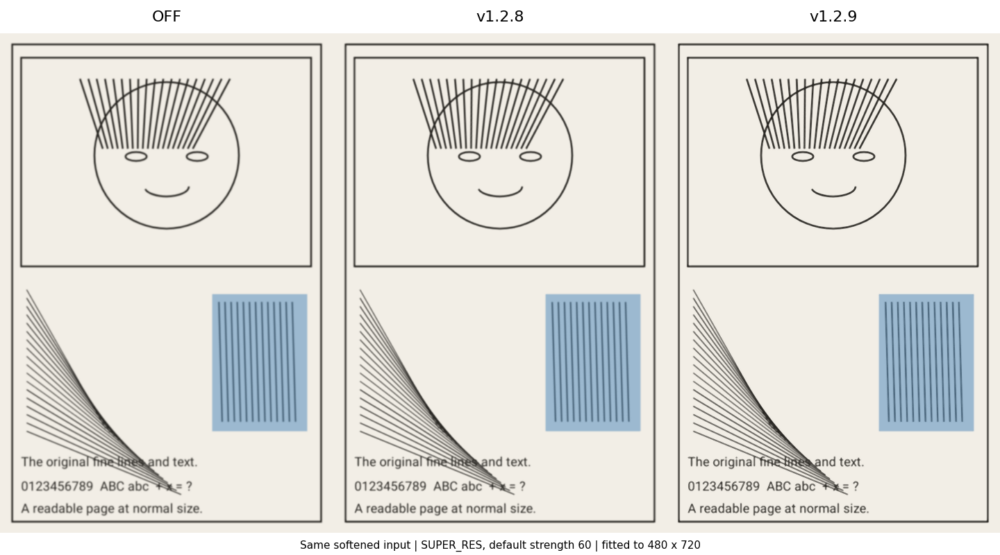

# 漫画增强实际可见性修正 · 1.2.9 / 210

用户在 1.2.8 反馈：开启各档增强或普通锐化后，整页和放大都看不出区别。检查与修复覆盖共同图像管线、设置预览及卷页展示，没有添加某一漫画源的特例。

## 诊断

1. 管线确实执行，但 1.2.8 把亮度变化严格钳制在十字邻域最小值与最大值内。模糊墨线的中心恰好是局部最小值，所以最需要加深的位置被钳回原值。回归样本的中心亮度为 120，旧版处理后仍为 120。
2. 超分档原先主要在放大后的一个像素范围内增强；整页适配屏幕时，这些变化容易被再次缩放削弱。轻量档的预降噪也会削弱本来就偏弱的细线恢复。
3. 卷页缺少 `PageLoadResult.error` 的提示，增强失败返回可读替代图时容易被理解为“增强完成”。预览事件只检查 loader 缓存，一旦最终图被 loader 淘汰，迟到的通知仍可能把卷页中的最终图替换成低清预览。
4. 设置预览先把整页缩到 540px，再挤进小面板；它无法展示原始细字。处理异常还曾静默缓存原图，并把它标成“当前效果”。

这些是代码与可重复测试确认的问题，不能据此认定用户手机上每一次“没有区别”都由同一个原因导致。

## 修正

- 原始尺寸使用两个空间尺度恢复模糊墨线，允许有双向梯度支持的柔化极值在有限范围内变深或变亮。平纸、线性渐变、颜色差及透明度保持；已聚焦的硬边不强行加重。
- 采样原图的陡峭边缘比例，降低已清晰页面的恢复力度；重建后的抗锯齿使用独立收尾内核，避免反复加深已经恢复的线条。
- 超分在放大前先恢复原始像素线条，再做 CNN / EASU 重建与抗锯齿收尾；轻量档减少不必要的预平滑。
- 最终图完成后移除临时预览；卷页缓存标记最终状态，拒绝迟到预览覆盖。卷页明确显示处理进度与增强失败重试。
- 设置可选“整页 / 原始细节”，默认共享原始像素区域作对比，两侧使用相同裁边与旋转。切档清掉旧预览状态，失败明确重试，不缓存替代图。`enhance-v3` 指纹使旧增强缓存失效。

EASU 与收尾锐化的区别参考 [AMD FSR1 官方文档](https://gpuopen.com/manuals/fidelityfx_sdk/techniques/super-resolution-spatial/)。CNN 仍使用已内置、保留许可的 Anime4K 固定权重；本轮没有把更高的分辨率或颜色变化当作新增真实细节。

## 验证

对比使用同一份清晰线稿参考、5×5 高斯软化后的 600×900 输入，以及实际 480×720 阅读尺寸。四档增强和普通锐化均使用默认强度 60；数字是对清晰参考的 MSE 误差下降，不能解释成所有漫画同等的体感提升。

| 开启方式 | 1.2.8 误差下降 | 本轮误差下降 |
| --- | ---: | ---: |
| 锐化增强 | 21.54% | 38.38% |
| Anime4K 轻量 | 15.42% | 32.73% |
| 超分 完整 | 22.50% | 46.57% |
| 超分辨率 | 20.66% | 52.42% |
| 普通锐化 | 21.54% | 38.38% |

模糊墨线中心亮度 120 → 110，平纸不变。另一份已清晰的斜线 / 小字 2× 重建参考保持 PSNR 30.25 dB，与 1.2.8 一致；新增 30 dB 下限，防止为了增强体感损害已清晰内容。

286 / 286 项漫画 JVM / Robolectric 回归通过，35 个套件，无失败、错误或跳过；包括设置预览真正的失败重试与恢复。UI gate 通过。正式 Release 构建与 Android 测试源码编译通过；APK 24,096,983 B，实际版本 1.2.9 / 210，arm64-only、最低 API 24，原签名、ZIP CRC、16 KiB ZIP 对齐及内置模型 / 许可字节一致性通过；812 项构建输入前后不变。APK SHA256：`b07f8546bbb371ed3a1e9c3e5bcbbce58299cb9859ed5ad5c486f566903e83eb`。[GitHub Release](https://github.com/roxycon-dev/Ciallo-Reader/releases/tag/v1.2.9) 附 APK 与 SHA256SUMS.txt，服务端大小与摘要在上传完成后核对。完整回执归档 `artifacts/release-1.2.9/`。按用户要求，没有运行模拟器或设备实测；合成质量对比和 Robolectric 渲染均为电脑端证据。

同输入、同强度、同显示尺寸的对比（关闭 / 1.2.8 / 1.2.9）：

