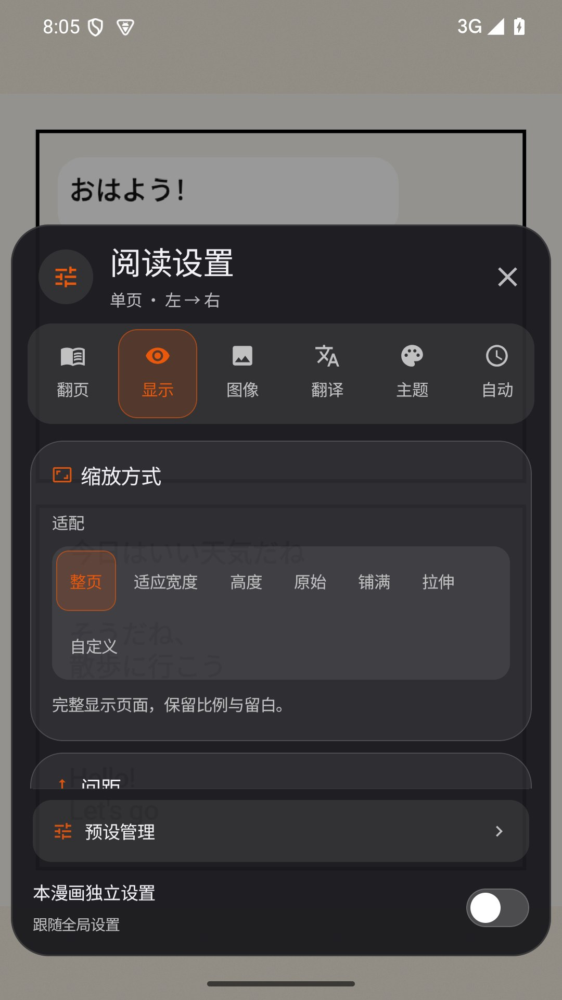
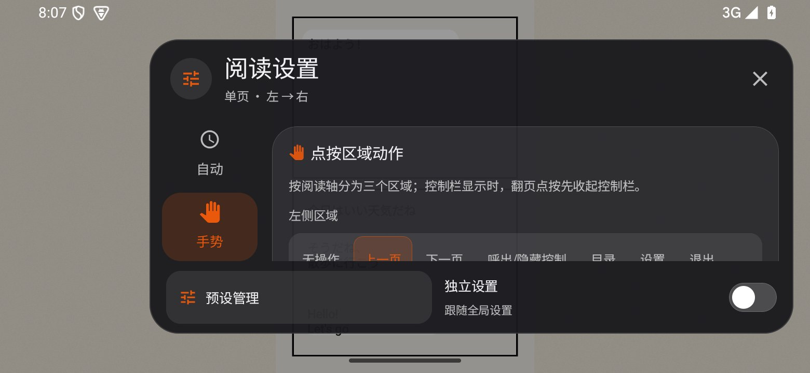
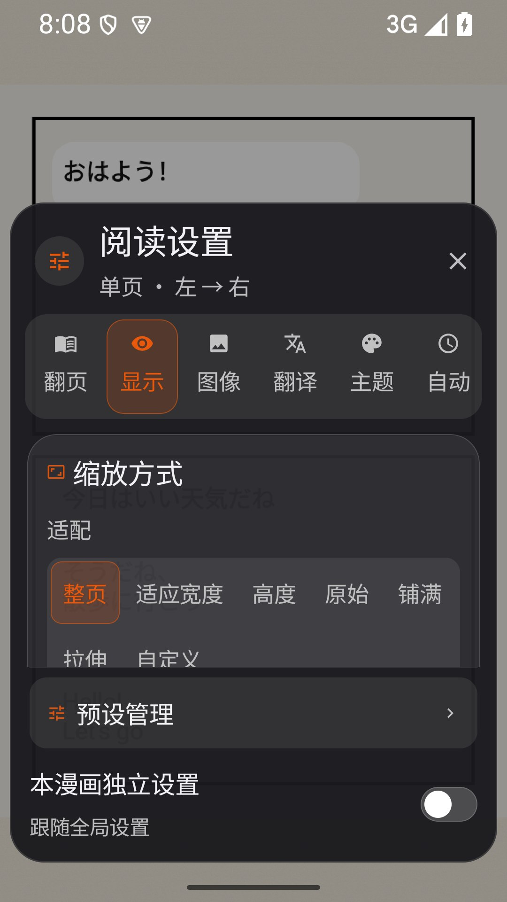

# 漫画阅读器逐项打磨 · 1.2.5

本轮按用户要求保留 1.2.5 / 206，替换原 Release 安装包。在首次 1.2.5 发布上继续检查七个设置分类、54 个配置字段，以及裁边、目录、预设、当前页状态等操作。保留所有原有功能、应用主题色和 Switch 外观，补齐实际接线、状态隔离、边界处理、动效和辅助功能。没有把“全部配置可保存”当作“所有功能达到竞品最佳”的证明。

## 逐项检查与改进

| 分类 | 功能 | 本轮处理 / 检查结果 |
| --- | --- | --- |
| 翻页 | 单页 / 双页 / 条漫 / 无缝 / 磁吸 | 保留五种引擎；补齐模式说明、动画选择态和 48dp 点击范围；明确各模式支持的动画与间距。 |
| 翻页 | 左→右 / 右→左 / 上→下 | 方向选择增加动画和单选语义；手势设置显示对应的物理左右 / 上下区域；保留 RTL 图像正向与镜像手势。 |
| 翻页 | 无动画 / 滑动 / 淡入 / 仿真 | 保留全部动画；保留 1.2.5 的方向仲裁、速度与距离结合、左右点按揭页动画，以及静态背景 / 独立书页边界。 |
| 翻页 | 条漫磁吸 | 保留吸附开关；无缝模式的固定零间距、自由滚动改用说明文字表达，避免假开关。 |
| 显示 | 整页 / 宽度 / 高度 / 原始 / 铺满 / 拉伸 / 自定义 | 补回遗漏的“适应宽度”；七个选项与默认值一致；修复双页 Compose / GL 都只按整页适配的问题。 |
| 显示 | 自定义基础与系数 | 六种基础方式全部可选，系数 50–250%；修复 GL 自定义缩放重复乘系数；保存的 CUSTOM 基础修复为整页，避免递归。 |
| 显示 | 自定义缩放档位 | 保留命名、保存、应用、删除；修复空名称和非法系数 / 基础；提高点击范围和名称换行空间。 |
| 显示 | 页面间距 / 双页间距 | 保留各自设置；提示无缝固定零间距及双页间距的生效条件；非法导入值限制在 0–40dp。 |
| 显示 | 封面单独 / 双页对齐 / X、Y 修正 | 保留全部对齐与偏移；提供一键恢复双页布局；偏移限制在 ±40dp。 |
| 显示 | 双击放大 | 修复原生仿真只打开浮层、第一下没有真正放大的问题；首次双击直接以落指为焦点放大；垂直模式尊重关闭选项。 |
| 显示 | 长按放大 | 修复原生第一条 MOVE 丢失；按住时可平移，松开恢复；垂直模式补齐临时放大 / 松手恢复。 |
| 显示 | 放大时翻页 | 原生放大层接入共享手势和实际内容尺寸；保留边缘翻页开关；双页快照保留间隙、对齐与 RTL 顺序，不烘入阅读背景。 |
| 图像 | 自动裁边 / 手动裁边 / 清除 | 手动默认与重置都为完整原图；角、边、框内移动全部保留 / 补齐；最小 5% 选区，拖过对侧不崩溃；贴边触觉节流；操作行可换行。 |
| 图像 | 宽页拆分 / 左右反转 / 拆分位置 | 保留宽高比与书缝识别；补充生效说明和位置 / 顺序恢复；临时合页双方都免拆分，避免合页后丢失配对。 |
| 图像 | 整本旋转 / 当前页旋转 | 保留 90° 档位与本页加 90°；新增还原本页旋转；滤镜预览纳入本页与整本的组合旋转。 |
| 图像 | 临时合页 / 取消 | 工具栏和设置使用同一规则；新合页移除相邻冲突锚点，末页禁用；布局丢弃越界 / 重叠锚点；换章不沿用旧页序号锚点；垂直模式完整保留原页。 |
| 图像 | 全部增强引擎与强度 | 保留现有 OFF / CAS / Anime4K Restore CNN / Anime4K Upscale CNN ×2 / Lanczos ×2 路径；强度 0 现在严格返回原图、成本估计为 0；保留预算、预览与降级机制。 |
| 图像 | 亮度 / 对比度 / 饱和度 / 色相 / Gamma / 锐化 / 阴影 / 黑白 | 全部保留；预览改为“原图 / 当前效果”并排，保持比例；80ms 防抖，取消安全；保留一键恢复滤镜。 |
| 翻译 | 自动识别 / 日文 / 英文 / 韩文 | 补齐韩文入口，保留自动识别；独立语种缓存键继续生效。 |
| 翻译 | 免费在线翻译 | 延续 1.2.5 腾讯批量接口、10 秒请求预算、去重与对白缓存；连接测试先清样例内存缓存，显示实际网络请求耗时。 |
| 翻译 | 自定义 AI 引擎 | 地址解析支持带版本基础路径和完整 chat/completions 地址；Gemini 路径 / 密钥使用 URL 编码；拒绝空译文；请求设总超时，保留严格 ID 验证和重试。 |
| 翻译 | AI 地址 / 模型 / 密钥 / 接口格式 | 密钥默认遮蔽，可显示 / 隐藏；输入 500ms 防抖保存，离开时补存并刷新；增加真实样例连接测试与成功 / 失败反馈。 |
| 翻译 | OCR 模型下载 / 状态 | 手动下载由阅读器作用域拥有，切换分类不取消；模型状态作为信息展示，避免不可操作的假开关；保留下载进度、失败重试和首下载 Ready 校验。 |
| 翻译 | 译文字号 | 保留 80–140% 与重烘焙路径；保留 OCR 行限制擦字、横排 / 竖排拟合、边框保护。 |
| 翻译 | 缓存大小 / 清除 / 失败重试 | 清除等待在飞任务取消，清对白内存与磁盘缓存、撤销已烘焙位图并刷新；旧任务不再回写缓存；修复快速任务注册竞态。开着翻译时会自然重译当前窗口并产生新缓存。 |
| 翻译 | 隐私 / 无痕限制 | 保留隐私锁启用或无痕浏览时禁止外发对白的现有规则；不增加默认 Google 请求或本地翻译服务。 |
| 主题 | 黑 / 白 / 灰 / 纸张 / 沉浸背景 | 色卡整项可点击、单选语义、描边颜色动画；保留动态主色提取及缓存；仿真缩放浮层使用实际阅读背景。 |
| 主题 | 纸张纹理强度 | 0 现在真正为平色，不再残留噪声纹理；其它档位保留纸张颗粒。 |
| 主题 | 全部八种场景 | 保留关闭 / 雨夜 / 落雪 / 樱花 / 萤火 / 海边 / 篝火 / 夏夜；卡片单选语义与颜色动画，48dp 以上操作范围。 |
| 主题 | 环境声音 / 音量 | 使用异步准备，避免主线程阻塞；录音打开失败清资源并保留程序合成兜底；后台暂停，恢复继续；停止前解除 AudioTrack 阻塞写入。 |
| 主题 | 特效独立开关 | 保留与声音独立控制；后台停止逐帧特效；场景切换释放旧资源。 |
| 主题 | 沉浸式系统栏 | 保留进入 / 退出恢复机制和安全区域；与手机、横屏关闭入口一起复核。 |
| 自动 | 自动翻页间隔 | UI 覆盖完整 1–120 秒范围、整数步进；设置 / 目录 / 预设 / 裁边和后台暂停；手动翻页重置仿真计时，不在落指时抢翻。 |
| 自动 | 连续滚动速度 | UI 覆盖 5–400dp/s；帧时间钳制，触摸、惯性滚动与放大时暂停；长末页到底后再换章，避免过早跳章。 |
| 手势 | 左 / 中 / 右点击动作 | 保留所有动作组合；对应当前方向说明；提供恢复默认点击动作；保留快捷翻页与控制层切换。 |
| 手势 | 滑动翻页开关 | 保留距离 + 速度判定与模式差异；仿真拖动方向由实际移动决定，点按仍由物理点击区决定。 |
| 手势 | 捏合退出 | 原生仿真第一条双指触摸流连续交给缩放状态；垂直模式补齐缩小退出；保留关闭开关。 |
| 手势 | 边缘关闭 | 原生仿真补齐边缘起点、触摸容差、轴向与提交行程；保留边缘点按翻页；放大时避免误关闭。 |
| 手势 | 长按控制层 | 保留与长按放大的优先级说明；垂直与原生路径都接线。 |
| 手势 | 音量键翻页 | 注册读取最新布局回调；打开面板和后台时释放拦截，音量键回到系统；关闭后恢复方向语义。 |
| 手势 | 进度缩略图 | 保留预览开关、窗口加载和连续滚动位置；当前页恢复不再被首次布局重建清成第 1 页。 |
| 配置 | 本漫画独立 / 全局 | 关闭独立配置删除覆盖并加载全局，不覆盖其它书默认值；取消尚未落盘任务；所有 54 字段统一正常化。 |
| 预设 | 新建 / 应用 / 复制 / 重命名 / 收藏 / 默认 / 删除 | 全部保留；补齐“用当前设置更新预设”；删除确认；点击目标 48dp；收藏快捷入口每次重新读取，空收藏长按打开管理；退出阅读不再覆盖刚设好的默认预设。 |
| 目录 | 章节 / 页面定位 | 保留现有分页定位、章节与缩略图路径；保留 1.2.5 自适应窗口、独立滚动与明确关闭。 |

## 验证范围

- 294 项专项 JVM / Robolectric 测试通过，37 个套件，0 失败、0 错误、0 跳过；包含漫画全部现有专项、翻译、小说排版与开屏回归，以及显式开启的腾讯真实 HTTPS 日英批量 / 缓存测试。新增 25 项定义，本仓库总计 715 项 JVM 定义；定义数不是全应用执行数。
- 6 项 Android 模拟器设备测试通过：真实生产 Core / GL 的首次双击与长按交接、面板暂停自动阅读与音量键、左右点按动画、拖动方向仲裁、单 / 双页 LTR / RTL 与静态背景。
- 模拟器手机 411×731dp、平板 1280×800dp、短横屏 780×360dp、手机 1.5 倍系统字体：七个分类、侧栏 / 横滑分类可达、外部触摸不关闭及明确关闭通过。Native 单测另验证短横屏裁边画布不越出视口、拖过对侧不崩溃。
- 模拟器实际清空翻译缓存后重新完成 OCR / 在线翻译：前瞻样例页 4 区域成功约 7.35 秒，当前样例页 4 区域成功约 11.66 秒，日志均为 cached=false。最终复核中命中缓存的当前页 / 前瞻页各约 173ms；设置内真实在线测试 755ms 返回中文。耗时包含原生 OCR 与烘焙，不能等同于在线接口耗时或所有漫画的性能。
- 全部 54 字段配置往返、七种双页适配、全局 / 本书隔离、恢复页码、预设更新 / 删除取消、增强零强度、合页 / 拆分、AI 地址 / 空译文与真实缩放交接均有回归证据。配置往返证明存储契约，不代替每个引擎、每种漫画和每款设备的长期实测。
- 正式包 1.2.5 / 206，24,061,360 字节（约 22.95 MiB），arm64-v8a；签名与首次 1.2.5 一致。签名、版本 / 包名 / ABI、ZIP CRC、16KB ZIP 对齐及 797 个构建输入摘要检查通过；正式 arm64 包覆盖安装、手机及重新启动的平板模拟器冷启动通过，无 AndroidRuntime 致命异常。原始测试、XML、截图与构建归档保留在本机 artifacts/release-1.2.5-comic-polish/ 和 artifacts/comic-feature-device/。

公开免费翻译服务没有稳定性承诺；OCR 与气泡定位仍受扫描清晰度、艺术字、复杂背景、网络和服务负载影响。没有接入真实用户 AI 密钥，也没有大样本竞品横向评测，因此不宣称已达到“业内顶尖”。本轮的目标是逐项减少实际缺陷，并保留可验证的改进证据。

改变正式包窗口尺寸时 Windows QEMU 宿主发生 0xc0000005 崩溃；新启动模拟器重新安装正式包后，平板冷启动复核通过。动态尺寸变更的这次失败不记作通过，也不与 Android 应用崩溃混为一谈。没有真实手机实装或全部设备覆盖。

UI gate 仍未通过旧字面量数量基线：字体 618 / 549、圆角 360 / 327、颜色 330 / 311、空图标说明 123 / 118、dp 2757 / 2528、sp 690 / 610；contentType 为 31 / 27。没有重设基线掩盖此项，也不能报告为全应用所有检查均通过。仿真 GL 使用不参与 Compose 捕获的 SurfaceView，设置采用更安静的深色底保证文字清楚；其它引擎继续使用现有模糊玻璃效果，不改全局玻璃库和 Switch。

## 实际界面

以下为 Android 模拟器实际界面，漫画为生成的验证样例。

安装包 SHA-256：`95c8fb2e102a8149b422d5cee1a7806f05bbfc1fde0f85832f2f166b137eb117`。

[下载同版本更新后的 1.2.5](https://github.com/roxycon-dev/Ciallo-Reader/releases/tag/v1.2.5)，附件仍为 APK + SHA256SUMS.txt。
