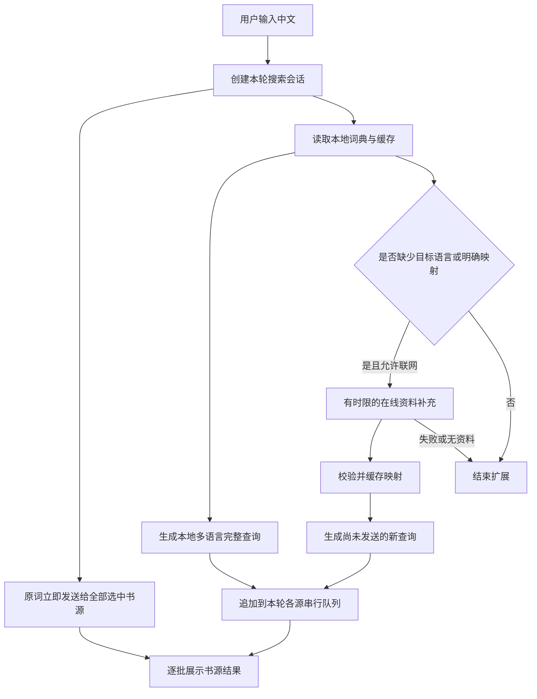

# 中文关键词跨语言聚合搜索方案

日期：2026-10-05  
项目：Ciallo阅读 / novel-reader  
状态：主体方案已实现，实际实现与验证见文末“实施校准”；前文为原始设计，不能将全部建议当作已上线功能。

## 1. 目标和确定的产品原则

用户只需输入中文，系统从常用词映射和专有名称映射中找到英文、日文、罗马音等叫法，分别交给各书源搜索。资料本地优先，缺少时在线补充，并在允许的范围内缓存。

用户已明确的原则：

- 发送普通关键词。例如输入“眼镜”，可以分别发送“眼镜”“glasses”“眼鏡”。
- 不自动添加 `tag:`、`character:`、`parody:`、`artist:` 等站点语法。
- 所有选中的书源收到同一份关键词序列；不按书源偏好擅自省略某种语言。
- 每个完整查询分别请求，不把多语言叫法拼成一长串。
- 书源返回什么结果就展示什么。关键词映射只影响请求，不负责判断书源结果是否相关。
- 同源同资源 ID 去重，跨源结果保留，不按标题相似度合并资源。
- 输入中文不等于只找中文版，不自动添加结果语言限制。
- 原词立即搜索；词典、在线补充、词库更新不阻塞原词搜索。
- 原词已有结果时仍执行本轮预算内的扩展请求，不能以“已经搜到”为由停止补搜。

第一版包含：常用词映射、专有名称映射、本地索引、缺失资料在线补充、持久缓存、聚合与单源搜索接入。中文、英文、日文为默认目标语言；有资料时补充罗马音。

AI 自由猜词、普通机器翻译、剧情描述检索、向量检索、按标签筛选结果、跨源合并作品均不属于第一版必需功能。未来如增加翻译兜底，独立开关，不与已验证的词条混存。

## 2. 当前代码和可以复用的基础

依据当前工作区源码核对；PROJECT_GUIDE.md 的历史行数不作为实施时的精确行号。

| 现有位置 | 当前行为 | 接入方向 |
| --- | --- | --- |
| `library/LibraryViewModel.kt` 的 `expandVariants()` | 查询本地 AniList 标题索引，最多 6 个变体，短时内存缓存 | 提取为通用关键词扩展模块，输出分批新增的完整查询 |
| `source/anilist/AniListModels.kt` | 原词与作品标题组成变体 | 复用标题数据；新增普通词、角色、作者等概念类型 |
| `source/anilist/TitleNormalizer.kt` | 繁简、日式汉字、大小写和标点归一化 | 保留现有用途；新模块分别定义匹配键与发送去重键 |
| `data/AppDatabase.kt` 的 `AniListDao` | 精确匹配、包含匹配、按 mediaId 取标题 | 作为专有名称的一种本地提供者；不覆盖旧表 |
| `library/ComicAggregateSearch.kt` | 原词先排队，漫画最多 8 路并发，同源变体串行，逐批发布 | 保持并发和发布语义，支持本地批次与在线新增批次 |
| `library/SourceSearchCoordinator.kt` | 同源互斥、1.1 秒间隔、60 秒结果缓存 | 原样复用；仍由它协调聚合、单源等搜索调用 |
| `LibraryViewModel.kt` 的小说聚合及单源分支 | 先等待完整变体列表；单源最终统一展示 | 同步改成原词优先和逐批结果，避免只有漫画获得新行为 |
| `source/ComicInfo.kt` 的 `alternateTitles` | 保存源返回的别名 | 同一条详情记录里的别名可成为带来源的本地映射资料 |
| `source/BookSource.kt` 的 `search(keyword)` | 接收普通字符串 | 接口不需要增加站点语法或标签参数 |

当前两个具体问题：

1. `getRawTitlesFor()` 按 `mediaId ASC` 排序，不能代表相关性；标题表命中多个作品时，小 ID 的标题可能先占满预算。
2. `SearchVariantBuilder` 给原词也应用最短长度规则，且以繁简折叠后的 compact 值去重。新模块必须无条件保留非空原词，不能把需要分别发送的“眼镜”和“眼鏡”去重成一个。

当前漫画 OCR 的 `TextTranslator` 目标语言固定为简体中文，不能直接作为中文到英文、日文的扩展引擎。本方案也不要求新增翻译依赖。

## 3. 搜索流程

示例：“眼镜”本地已有英文和日文。

1. 各源先搜索“眼镜”。
2. 本地返回“glasses”“眼鏡”，分别补搜，不添加命名空间。
3. 本地已满足默认目标语言，无需本次在线查词。
4. 每次响应立即追加结果，同源相同 ID 只显示一次。

示例：某个中文角色名只在本地有日文别名。

1. 原词与已知日文别名先进入搜索队列。
2. 支持该实体类型的在线提供者按需查资料，获得英文名或罗马音后补入。
3. 在线未找到可靠对应条目时，不凭空创建英文名；原词与日文搜索正常完成。
4. 下次相同查询优先命中允许保存的本地缓存。

## 4. 常用词映射

采用“一个概念，多个语言叫法”的组织方式，词条内区分查询名称和中文输入别称。

| 概念 | 中文名称 / 输入别称 | 英文查询 | 日文查询 |
| --- | --- | --- | --- |
| 眼镜 | 眼镜、眼鏡；经人工核验的输入别称 | glasses | 眼鏡 |
| 其他常用概念 | 经核验的中文名称和别称 | 数据提供方的实际关键词 | 有资料的日文名称 |

实施规则：

- EhTagTranslation 作为候选词库：从中文名称反向查原始英文标签，仅取标签文本，不取命名空间作为请求内容。
- 数据源中的 namespace 可保留在来源字段中用于区分词条，不能自动拼进搜索字符串。
- 数据库主要提供 E 站标签与中文译名，不保证有日文。日文名称需来自独立核验的词条资料；缺失就保留缺失。
- 只用名称、已核验的别称和原始词做自动映射。描述中的任意词不能自动等同于该词条。
- 不自动把所有包含“眼镜”的长句都映射成“glasses”。第一版只接受已收录的名称 / 别称或明确分词输入。
- 用户补充映射可以覆盖自己的检索偏好；应能查看、修改、删除和禁用。第三方资料更新不覆盖用户记录。
- 一个中文别称可能对应多个概念；保留候选和来源，不将它们永久合并成一个概念。

词库获取采用“随版本固定的可追溯种子包 + 后台更新”，不用运行时逐条爬站。实际种子规模、APK 增量和导入耗时在实施阶段测量，不能以未经测量的数据承诺包体。

## 5. 专有名称映射

覆盖作品名、角色名、作者 / 画师名和社团名。各类资料能力如下：

| 提供者 | 用途 | 边界 |
| --- | --- | --- |
| 现有 AniList 本地标题表 | 作品原名、英文名、罗马音、synonyms | 现有数据属于 MANGA 查询范围，不能宣称覆盖所有小说、角色和作者 |
| 标签翻译资料中相关条目 | 已收录作品、角色、作者 / 社团名称 | 中文译名与别名的完整性逐条依据实际数据 |
| 本地用户映射 | 用户熟悉的简称、译名、作者别称 | 用户自己的映射，不上传共享 |
| 同一书源同一资源的详情 | 标题与 alternateTitles、明确的作者别名 | 必须有同条记录或明确关系支持；不能凭标题相似串联 |
| 在线元数据提供者 | 按需获取特定作品或实体的名称 | 每个提供者只处理其经过验证支持的实体类型 |

在线第一批优先接入 AniList 作品查询及 Bangumi 作品资料。角色、作者、社团只在相应提供者的检索、字段和别名关系核验后启用；通过提供者能力声明控制，不能把作品搜索接口当成通用人名搜索。

实体 ID 使用来源限定格式，例如 `anilist:media:123`、`ehtag:character:某原始词`、`user:某UUID`。不同网站的数字 ID 不能直接当成相同实体，也不能根据名称近似自动合并。

匹配优先级：完整名称精确匹配 → 已核验别称 → 有边界的前缀 / 包含匹配。模糊匹配用于候选，不能把相似作者或不同改编作品写成永久等价关系。

歧义词默认自动选择少量有明确名称依据的候选扩展，不强制弹窗打断搜索。可在“搜索用词”展开项中切换候选；未明确选中的候选仍保持独立实体。普通词扩展不因同时命中一个作品名就被整体丢弃。

## 6. 本地缺少时如何在线补充

“缺少”按目标语言和实体资料判断，不能只看有没有任意一条本地命中。

| 本地情况 | 处理 |
| --- | --- |
| 已有满足目标语言的有效映射 | 本轮不联网查词 |
| 命中词条，但缺英文或日文 | 仅请求能补该资料的提供者 |
| 无常用词映射，词库有新版本 | 后台拉取一次词库快照，导入后重新查本轮输入 |
| 无专名映射 | 调用支持对应实体的在线检索，有限候选查询 |
| 网络不可用、关闭在线补充或提供者未支持 | 原词和已有映射继续搜索 |
| 搜索结果为空但映射完整 | 不视为查词失败，不自动反复扩展不相干词 |

EhTagTranslation 的已核实发布形式是数据库快照，不能假定它提供稳定的中文逐词查询 API。第一版用发布快照更新；同一版本不重复下载，正在更新时所有缺词查询共享同一个更新任务。本地缺词不会触发每次下载完整数据库。

提供者边界：

- AniList 支持按 `search` 查询作品名称；从响应读取原名、英文名、罗马音和 synonyms。按需获取少量候选，不恢复全量分页拉取任务。
- Bangumi 作为中文作品资料补充候选；字段、匹配和在线可达性在实施阶段用固定样本验证。
- 常用词如果在最新词库及已接入提供者中都找不到，则明确保持未命中。第一版不承诺所有中文词都能获得在线翻译。
- 允许的书源详情资料可在用户正常打开详情时记入映射，不为搜词额外遍历全部结果页或所有详情。
- 记录每个名称的来源、实体关联和版本；网络接口返回的说明文字不作为待执行内容。

建议的第一版运行参数（设计默认值，需实测调优）：

| 参数 | 默认值 |
| --- | --- |
| 在线补充总等待窗口 | 6 秒，仅影响补词阶段 |
| 元数据请求并发 | 2，与书源搜索并发池分开 |
| 每个提供者候选数 | 最多 3 个，再按匹配依据选择 |
| 单轮元数据请求数 | 最多 4 次，包含候选详情，不含独立词库更新 |
| 同一提供者无匹配的负缓存 | 6 小时，以词库 / 提供者版本为键 |
| 提供者临时网络失败冷却 | 5 分钟，与“确实无词条”分开 |
| 非受特殊限制的映射缓存 | 默认 30 天；提供者规则优先 |
| 词库版本检查间隔 | 不短于 24 小时，可手动检查 |

响应 429 时遵循 Retry-After 和相关限流头，本轮不忙等重试。提供者变更或更新词库后使对应负缓存失效。

已缓存且允许继续使用的过期映射可以先用于检索，后台刷新。到达在线补充窗口后，当前搜索不再接受新查询；后续词库下载可完成导入供下次使用，但不能让已结束搜索重新开始。

隐私模式 / 无痕下：第一版禁用额外在线查词、查询历史和新增持久映射；仍可读取本地词典，用户主动进行的书源搜索沿用现有规则。普通模式发送给元数据服务的内容仅为缺失关键词和必要检索参数，不发送书架、阅读历史或书源账号凭据。

## 7. 关键词构建与去重

### 7.1 两套不同的归一化

**匹配键**用于查词：NFKC、拉丁大小写归一、可检索的繁简 / 异体字别称。原始词必须另外保存；有损折叠只能用于召回候选，不能证明两个实体相同。

**发送去重键**用于减少重复请求：原始字符串去首尾空白，必要时合并普通空白，并采用 Locale.ROOT 处理拉丁大小写。第一版采取保守规则，不折叠汉字、不删除假名长音、不删除内部标点。

因此“眼镜”“眼鏡”“glasses”可分别发送；不同名字“名称-A”“名称A”也不能因为删标点而只剩一个。用户原词永远保留，字数为 1 的有效输入也不能被普通变体最短长度规则删掉。

### 7.2 请求顺序和预算

- 每轮默认最多 6 个完整查询，原词占 1 个；这是请求数量限制，不是保证有 6 个语言版本。
- 本地命中先发布，本轮所有候选查询通过同一个预算器分配，在线补词不会再额外获得一套 6 次额度。
- 首批本地扩展最多先占 3 个额外槽位，为缺失语言的在线补充保留最多 2 个槽位。在线结束后若有余量，再补尚未搜索的本地候选。
- 分配扩展槽位先照顾英文、日文，再考虑罗马音、其他中文译名和同语言别称，避免英文多个叫法先占满全部预算。
- 同一来源实体的准确别名优先于其他候选实体的弱包含匹配；不再按 mediaId 大小决定优先级。
- 预算内的查询统一交给全部选中书源；每源发送去重，跨源不共享“已经发过”的集合。
- 每个源原词先排队，扩展同源串行，共用现有 SourceSearchCoordinator。漫画 8 路、小说 4 路和原有站点超时先保留，再依据实测调整。
- 若某源一直超时，遵循现有取消 / 超时规则，不突破预算反复重试；其他源继续完成。

如果选中 S 个源，第一版每轮应用层搜索调用最多为 `S × 6`；缓存可减少实际网络调用，书源内部请求次数仍由各源实现决定。在线元数据请求另计。

### 7.3 多关键词输入

第一版支持完整词条，以及用空格或明确分隔符输入的多个关键词；不承诺任意中文长句自动分词。

1. 优先检查整段输入是否为作品、作者或一个多词词条，不能先把完整作品名拆散。
2. 未整段命中时，对明确分隔的输入按最长已知词条识别；普通未知片段保留。
3. 同一语言的各部分组成完整查询。例如概念 A + 概念 B 生成“中文A 中文B”“英文A 英文B”“日文A 日文B”。
4. 某部分没有目标语言映射时原样保留，形成有依据的混合查询，不能猜一个名字。
5. 不生成所有别名的笛卡尔积；每语言优先一组，其他组合受同一个总预算限制。
6. 不擅自加入 AND、OR、引号、标签前缀或站点操作符。多个词的实际组合含义由书源决定。
7. 用户已有显式搜索表达式时完整保留原词；第一版只在能可靠识别普通片段的情况下扩展，否则退回原词，避免改坏手写表达式。

## 8. 本地数据结构和更新

建议在现有 Room 中新增下列数据结构；实体名是实施建议，可在编码时按项目命名约定调整。

| 结构 | 主要字段 | 作用 |
| --- | --- | --- |
| keyword_concepts | id、kind、provider、providerEntityId、provenance | 普通概念 / 作品 / 角色 / 作者 / 社团的来源身份 |
| keyword_aliases | conceptId、rawText、lang、matchKey、queryKey、role、origin、expiresAt | 名称、输入别称、可发送查询；名称语言未知时明确标为 und |
| keyword_lookup_cache | inputKey、targetLanguages、provider、status、conceptRefs、schemaVersion、expiresAt | 成功、无匹配、临时失败分开缓存 |
| keyword_dictionary_versions | provider、dataVersion、checkedAt、checksum、licenseRef | 更新与来源追溯 |

需要的索引：alias 匹配键、概念 ID、来源实体唯一键、缓存查询键。完整词典不常驻内存；使用 Room 索引检索，包含匹配只做有限候选兜底。

名称和来源关系不能因为查询文本相同就删除。对“发送请求”去重可以全局按查询键做；对“词条资料”去重必须包含概念 ID、语言和来源身份。

词库更新流程：下载临时文件 → 校验大小 / 格式 / 版本及可取得的校验值 → 导入暂存数据 → 数据库事务切换该提供者版本 → 使受影响缓存失效。失败保留上一份可用词库，不先清空有效数据。没有可信校验值时不把本地自行计算的哈希称为上游真实性证明。

用户映射与第三方快照分开标记，更新只替换该提供者数据。用户可以独立清理在线查词缓存，不能误删用户自定义映射和已有书籍。

当前数据库版本为 12。若期间无其他迁移，新增迁移为 12→13；实际实施时先检查最新版本和并行改动，不能硬占用迁移号。保持旧 AniList 表、书架、收藏、下载、阅读记录数据，禁止破坏性重建。

备份导出应包含用户自定义映射及相关设置；可重建第三方词库和在线缓存不默认打入备份。恢复时校验字段、来源与版本，不能将缓存提升成用户确认映射。

## 9. 代码拆分建议

统一放在新包 `source/keyword/`，避免把查词和在线调度继续堆进 LibraryViewModel。

| 建议组件 | 职责 |
| --- | --- |
| KeywordModels | 概念、别名、来源、扩展批次、查词阶段状态 |
| KeywordNormalizer | 匹配键、发送去重键，保留原始文本 |
| KeywordRepository | 本地索引、持久缓存、提供者能力选择、在线补充、同查询任务复用 |
| LocalKeywordProviders | 词库 / 用户映射 / 旧 AniList 标题 / 已核验详情别名的适配 |
| KeywordVariantBuilder | 候选选择、目标语言分配、完整查询组合和全轮预算 |
| OnlineKeywordProvider | 支持实体类型声明、按需检索接口；取消与网络错误不泄漏到搜索 |
| EhTagDictionaryUpdater | 快照解析、版本检查、事务更新，禁用动态执行脚本 |
| AniListKeywordProvider / BangumiKeywordProvider | 只请求已核验接口和字段，输出有来源的映射 |

扩展 API 推荐使用 `Flow<KeywordExpansionEvent>`：本地新增批次 → 在线新增批次 → 完成 / 降级。事件包含 query、lang、origin 和明确的结束状态；不能只暴露最终 List 让本地词等待在线查询。

原词由搜索会话立即入队，扩展流只提供新增查询。某源初次搜索后订阅不到历史批次会漏词，因此每个搜索会话需保存已接受查询列表，并向各源工作队列重放尚未执行的查询。可以采用会话内共享状态 + 源内顺序消费者，不依赖没有 replay 的广播。

查词任务复用键包含输入、目标语言、词库版本、用户映射版本和在线允许状态，防止无痕搜索复用正在联网的普通搜索任务。共享请求只有所有订阅者取消后才能取消；单个订阅者取消不能误伤其他仍有效会话。

漫画、小说聚合和单源搜索均使用同一扩展入口、请求预算器和同源协调器。前台结果代次检查保持不变，新增事件发布前也检查本轮是否仍有效。

## 10. 结果展示和使用体验

- 保持现有多语言搜索开关；开启后默认使用本地映射，在线补充另设开关，避免关闭联网后连本地映射一起失效。
- 搜索页可增加一行可折叠提示：“搜索用词：眼镜 / glasses / 眼鏡”。显示实际接受进入本轮队列的词，不显示未执行候选为“已搜索”。
- 展开可查看正在补充、已完成、无资料、超时等状态，以及词条来源。源内每词执行状态与扩展整体状态分开记录。
- 在线补充失败时用轻量状态说明，不弹出阻断式错误，也不覆盖已得到的书卡。
- 有结果的源在扩展仍进行时继续显示书卡；源速跳数量、折叠计数均以已收到结果计算。
- 同源同 ID 首次命中决定位置；可记录多个命中词供展开查看，不因为二次命中跳动排序。
- 书源返回的不同资源 ID 即便标题相同仍显示；跨源不去重。不能按语言、标题包含关系、标签或模型评分过滤结果。
- 不把点击、下载、收藏某资源自动等同于确认了一个翻译映射；用户确认或有明确元数据关系才成为可靠别名。

## 11. 实施顺序和交付范围

### 阶段 A：常用词和专名的本地扩展

完成两种归一化、数据结构与无损迁移、词库导入、旧 AniList 适配、用户映射，以及本地逐批扩展。用已核验的固定种子数据检验“眼镜 → glasses / 眼鏡”和若干作品、角色、作者名称。

交付：离线可用的普通关键词扩展，原词不被删掉，专有名称来源可追溯，第三方词库不冒充完整日文词典。

### 阶段 B：本地缺少时在线补充

完成在线提供者、词库快照更新、语言级缺失判断、成功 / 无匹配 / 临时失败缓存、限流、同任务复用及隐私模式规则。实现当前轮次窗口内补搜，过晚响应仅在允许时缓存供下次使用。

交付：无需用户手工继续收集大量作品名；已有资料直接用，缺失资料按需补充。没有资料的名称保持未命中，不承诺万能翻译。

### 阶段 C：全部搜索入口与用户体验

漫画聚合、小说聚合和单源统一接入分批扩展；补齐取消、切换源、切换类别与结果展示；增加实际搜索用词、在线补充开关、词库版本和缓存清理入口。

交付：书源搜索接口仍是普通字符串，结果诚实展示，重复命中只按原有资源身份去重。

### 阶段 D：实测和交付记录

完成必要 JVM 测试、数据库迁移测试与设备样本验证，记录每源实际关键词、首批结果时间、总请求次数和完成情况。测试通过后更新 PROJECT_GUIDE.md 中对应文件 / 算法 / 执行记录，并按用户后续授权决定是否构建 APK。

阶段划分用于实施顺序；A、B、C 均属于本次方案的完整功能范围，不把在线补充留成未接入的空接口。

## 12. 验收清单

| 场景 | 通过标准 |
| --- | --- |
| 本地普通词“眼镜” | 所有选中源收到“眼镜”“glasses”“眼鏡”，没有自动添加命名空间 |
| 原词一字或带标点 | 非空原词仍执行一次；不因最短长度或归一化损失消失 |
| 两语言汉字折叠相同 | 两个不同原始查询仍分别执行，不能把日文变体当中文重复删掉 |
| 专名本地命中 | 取该来源实体的已知叫法，不按 mediaId 大小挤占预算，不猜人名 |
| 本地只有部分目标语言 | 已有查询先执行，缺失资料成功返回后追加且全轮不超过预算 |
| 本地缺词且快照最新也无资料 | 保留原词，没有无限更新或生成假词条 |
| 多词输入 | 每次发送完整组合，不把各语言和多个条件混拼成一个大查询 |
| 原词已有结果 | 预算内外文查询仍执行，不自行结束扩展 |
| 提供者失败 / 限流 / 离线 | 书源原词搜索不被影响；已有结果保留，没有忙等重试 |
| 慢在线响应 | 本地扩展不等网络；关闭会话后不追加请求，不覆盖新查询 |
| 查询 A 很快切到 B | A 的扩展和源响应不能写入 B；取消语义与 native JS 收尾兼容 |
| 多别名命中同一资源 | 同源同 ID 只显示一次，首次位置稳定 |
| 同名不同资源 / 不同书源 | 全部保留，不按标题或语言过滤 |
| 多语言开关关闭 | 仅执行用户原词，不发生查词网络请求 |
| 在线补充关闭 | 本地多语言正常，缺失项不联网 |
| 再次查询 / 重启应用 | 允许持久化的在线映射仍可复用，不重复查同一词 |
| 隐私 / 无痕 | 只读本地映射，不额外在线查词、不写查词持久记录 |
| 词库更新失败 | 旧词库继续可用，用户映射和用户数据不受影响 |
| 数据库及备份迁移 | 书架、收藏、下载、阅读记录保持完整，用户映射可恢复 |

自动化测试重点覆盖：两种去重规则、预算语言分配、部分命中、快照重查、逐批发布、跨轮取消、共享查词订阅取消、429 处理和 Room 迁移。书源服务可能波动，自动化断言请求参数及结果保留规则，设备样本记录实际网络表现，不硬编码实时命中数量。

性能目标：原词请求不等待映射数据库或网络；本地检索在 IO 线程；首批本地扩展以目标设备 p95 不超过 200ms 为设计目标，实际指标实测确认。记录请求数和耗时即可，默认诊断不打印用户完整关键词和凭据。

## 13. 数据提供方资料及实施前核验

以下在线资料于 2026-10-05 查阅。能力说明基于官方文档 / 上游项目公开资料；未实测的接入不能写成已可用。

- [EhTagTranslation 数据库及说明](https://github.com/EhTagTranslation/Database)：中文标签资料来源候选。上游声明文本采用 CC BY-NC-SA 3.0，并要求下游使用前提交项目简介 / 地址的 Issue。实施采用该资料时保留来源与许可，按其要求处理派生词库，并完成下游登记；本次只写方案，未导入第三方数据、未向上游发送消息。
- [EhTagTranslation 开发指南](https://github.com/EhTagTranslation/Database/wiki/%E5%BC%80%E5%8F%91%E6%8C%87%E5%8D%97)：提供 JSON / gzip 发布快照，text 版本去掉图片和链接，适合提取名称。
- [AniList 分页及 search 查询示例](https://docs.anilist.co/guide/graphql/pagination)：支持按关键词检索作品，作为按需资料提供者。
- [AniList 限流](https://docs.anilist.co/guide/rate-limiting)：应读取限流头和 Retry-After，不依赖固定请求额度。
- [AniList 使用条款](https://docs.anilist.co/guide/terms-of-use)：禁止批量收集等用途；缓存与分发按提供方规则处理，不能默认把在线响应导出成全量内置资料包。
- [Bangumi 公开 API 文档](https://bangumi.github.io/api/)及[接口定义仓库](https://github.com/bangumi/api)：候选专名资料服务；具体检索接口、名称字段、鉴权、限流、许可和可缓存范围在接入时逐项核验。未核验的角色 / 作者能力不启用。
- [E-Hentai 搜索说明](https://ehwiki.org/wiki/Gallery_Searching)：裸关键词可以参与站内检索，支持本方案发送普通词的选择；本方案不引入额外站点语法。

可用性和许可核验属于资料接入准备，不阻止先实施独立的关键词模块和自有测试词条。没有合适上游资料时保留可导入接口与用户映射，明确实际覆盖，不能用 AI 编造资料来冒充完成。

## 14. 本次文档交付

已完成：梳理当前代码接入点，确定普通关键词、常用词 / 专有名称映射、本地优先、在线补充、请求预算、缓存及验收规则。

未实施：生产代码、数据库迁移、第三方数据导入、在线接口调用、设备实测和 APK 构建。方案中的名称、预算和目标是实施建议，不是已有功能或实测结果。

## 15. 实施校准（2026-10-05）

本节覆盖第 14 节的最初文档状态，说明用户授权实施后的实际结果。

已实现：常用词及作品 / 角色 / 作者 / 社团名称映射；原词立即搜索；本地扩展与在线扩展分批发布；中英日查询保留；每轮含原词最多 6 个完整查询；同源 ID 去重、跨源和同名不同 ID 保留；显示本轮搜索用词；独立在线补充开关和无痕禁用规则。

资料：自有种子 144 条，加 EhTagTranslation 名称资料 44,530 条、gzip 647,255 字节。译名的装饰 emoji 在建索引时清除，不改外文原始词。数据库许可证和派生说明见 [关键词资料来源](vendor-licenses/keyword-data.md)。旧 AniList 标题索引继续提供专名；当前实施的在线来源为 Wikidata 与 Bangumi，而非新增 AniList 在线查询。

存储方案调整：使用缓存目录的独立 SQLite 反向索引和最多 256 个查询的 AtomicFile JSON 缓存，保持用户主数据库版本 12，避免为可重建词库升级书架 / 收藏数据库。允许的在线缓存跨应用重启复用，系统清理缓存后可重建；没有用户自定义映射的数据迁移或新增备份表。

在线补充：总窗口 6 秒；每个关键词最多 Wikidata 2 次 + Bangumi 2 次请求，最多补 2 个缺失部分，因此全轮最多 8 次元数据请求；词库快照更新另计、最多每日检查一次。某提供者得到部分语言资料时，继续尝试备用来源。完整在线名称缓存 30 天，部分名称或明确无命中 6 小时；临时失败使用提供者冷却。快照更新先校验格式，再事务替换，失败保留旧版本。

实施边界：完整中文词条与有空格 / 分隔符的组合查询可扩展；任意长句自动分词、用户编辑映射入口、按点击自动学习、未知人名猜测和翻译引擎均未加入。缓存来源及时间由模块记录，UI 目前展示实际查询词，不提供复杂候选编辑面板。首用完整词库需要在 IO 线程建索引，原词搜索同时正常执行；未取得真实手机性能数据，不能把设计中的 200ms 宣称为实测。

测试和构建记录见 [多语言搜索实施报告](multilingual-keyword-search-implementation-2026-10-05.md)。
