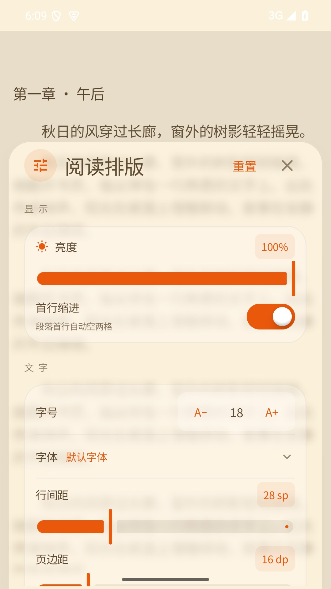
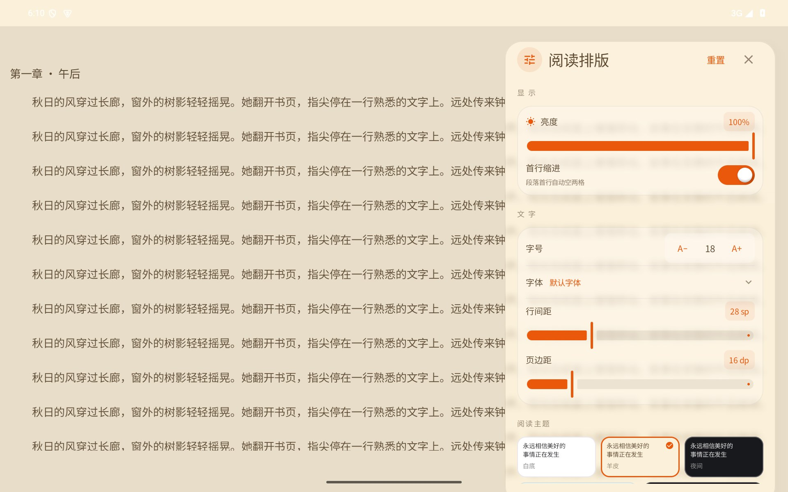
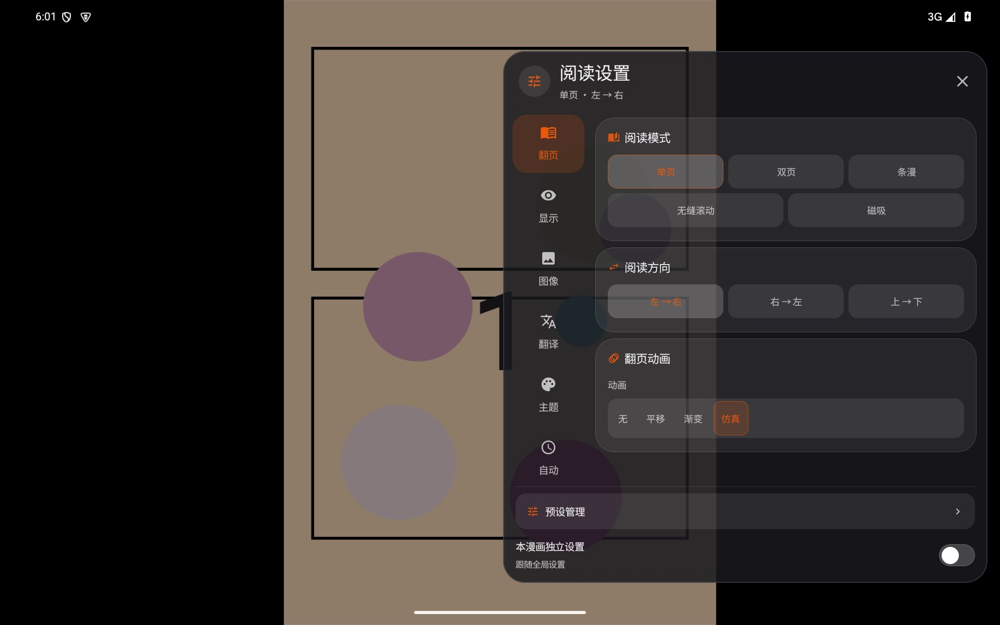

# Ciallo Reader 1.2.5 阅读体验优化

## 改动范围

- 小说阅读排版继续使用现有状态、持久化、字体和阅读主题。窗口从阅读背景取氛围色，从应用主题取交互强调色；使用 8dp 背景模糊、56% 主题玻璃底、24dp 浅色分组卡、数值徽标与轻量选择动画。阅读背景与正文一起进入玻璃捕获层，避免透明文字层与原正文叠出双影。`AppSwitch`、Squishy 开关实现、尺寸、配色和动画均未改。
- 手机设置位于屏幕底部，平板和横屏位于右侧。窗口宽度受限并保留正文预览；小说窗口支持进入、退出动画与明确关闭按钮。
- 漫画七个分类全部保留。宽屏使用可滚动侧栏，手机使用可滚动分类栏；内容独立滚动并保留各分类位置，切换时淡入淡出。短横屏配置区并排显示，避免挤压内容。
- 漫画设置外部点按不关闭窗口；空白区不会把触摸交给遮罩。关闭按钮和系统返回键退出，退出动画保留原面板内容。目录与预设也补齐自适应布局和关闭按钮。
- 滑条增加按压弹性、48dp 触控区、端点内缩、辅助功能调节，避免拇指裁切、垂直滚动和多指误调；选项增加颜色过渡、选择语义和自适应文字。

## 翻页修复

- 滑动方向在越过触摸容差并确认水平主导后确定，独立于落指侧。点按仍按原来的左右快捷区域及用户配置解析。
- 慢拖行程为视口的 18%，同时限制在 64–104dp；快速甩动需要至少 18dp 位移与同向 850dp/s 速度，明显反向回甩取消。普通分页保留 Compose 速度判定，磁吸和仿真使用相同的设备尺度规则。
- 点按和底栏的相邻仿真翻页通过真实逐帧的 260ms 揭页动画加原引擎收尾。大跨度目录跳转保留直接定位。并修复异步页码监听捕获初始值、导致点按动画被后续跳转覆盖的问题。
- 检查 GL 书页矩形是否仍然有效，修复引擎清掉矩形但缓存误认为已应用的问题；暂时的图片缓存缺失保留已知书页边界，图片尺寸独立于位图 LRU 保存。
- 翻页期间延后纹理重建，背景保持 GL 静态层，纸张占位与背面不使用阅读背景色。触摸和合成动画锚定实际书页边界。

## 翻译改进

- 使用[腾讯交互翻译](https://transmart.qq.com/)的公开在线接口，无 API Key、无 Google 请求、无本地翻译服务部署。现有本地 OCR 和气泡分割模型保留。
- 每批最多 24 段 / 6000 字，最多两批并发，整次批量请求 10 秒预算；512 条成功对白内存缓存，重复对白去重。失败不再逐句重复发起请求。
- 整页失败或部分失败给出重试入口；部分失败不写成永久完整页缓存。原文保持可见，成功区域可先显示。
- 有 OCR 行坐标时仅覆盖原文行，避免粗粒度气泡蒙版涂掉分镜线条；译文锚定原文行区域。OCR 行按阅读方向排序；译文缩放只应用一次，竖排以有效字号计算行列并裁切在文本框内，游离文字块沿用采样背景颜色。
- OCR 下载由阅读器管理，切换分类不再取消下载；设置显示共享下载状态、连接测试与真实请求耗时。
- 公共服务响应、OCR 识别率与译文质量仍取决于漫画清晰度、语种、网络和服务负载；不把单次接口成功等同于所有漫画达到竞品最佳水平。

## 发布前冷启动修复

正式包冷启动发现既有开屏取消路径仍在 `finally` 中导航，在配置重建 / 退出组合时可能触发 `home` back-stack entry 的 INITIALIZED→DESTROYED 崩溃。取消时直接重抛，仅正常完成才调用导航；使用最新回调，保留开屏停留、跳过和纯净模式。新增 3 项回归测试。

## 验证与发布

- 版本 `1.2.5 / 206`，正式包 `24,042,188` 字节（约 22.93 MiB），arm64-v8a；沿用 1.2.3 / 1.2.4 签名，R8 和资源精简保留。签名、ZIP CRC、16KB ZIP 对齐、版本和 ABI 检查均通过；794 个构建输入在构建前后摘要一致。
- 269 项专项 JVM / Robolectric 测试通过，35 个测试套件，0 失败、0 错误、0 跳过。覆盖漫画布局与处理、手势仲裁、翻译请求缓存 / 失败、OCR 和文字绘制、小说设置。包含真实腾讯 HTTPS 的日文 / 英文测试；并非全应用所有测试的执行声明。
- Android 模拟器真实 GL 设备测试 3 项通过：单 / 双页 LTR / RTL、左侧落指向左拖仍向后翻页、左右点按动画、背景静态。像素回归验证粗蒙版不改原文外的画面、暗色竖排可读且不越界。
- Native 截图矩阵包含手机 411×891dp、平板横屏 1280×800dp、短横屏 780×360dp、1.5 倍系统字体；同时检查真实模拟器小说五种主题、平板七个漫画分类、短横屏关闭和外部点按不误关闭。
- 首次模型下载和无翻译缓存的真实流程完成：35,045,540 字节模型重新下载，停留当前页自动开始 OCR 和在线翻译，两个样例页各 4 个区域全部返回中文。缓存页处理约 165ms；本机冷启动样例整页约 10–14 秒，在与 Release 构建争用 CPU 的首次下载复核中为 25.3 / 31.3 秒。在线接口两组对白测试合计约 1.14 秒，缓存请求低于 250ms。上述单次样例不能代替真实漫画、手机或长期延迟基准。
- `tools/ui-gate.ps1` 未通过旧 UI 字面量数量基线；本轮增加了排版样式值，未修改基线掩盖增长。该项需后续统一设计 token 工作处理，不能报告为全量检查通过。
- 验收日志、原始 XML、模拟器截图与发布回执保留在本机 `artifacts/release-1.2.5/` 和 `artifacts/reader125-device/`。正式 arm64 包在模拟器覆盖安装，两次冷启动及启动期窗口方向 / 密度变化复核通过，无 AndroidRuntime 致命异常。最终复核使用 swangle 图形后端并关闭 Vulkan；此前 swiftshader_indirect 下 QEMU 宿主访问违规崩溃，已由 Windows 应用日志区分。Debug 探针不进入正式包；没有用户手机实装或全部平板型号覆盖。

安装包 SHA-256：`332c0fa06bcbde8189476537a5ed09d5c1c78b91c3a865d3df7a4a3dde740245`。

[下载 1.2.5 Release](https://github.com/roxycon-dev/Ciallo-Reader/releases/tag/v1.2.5)，附件沿用 APK + `SHA256SUMS.txt`。

## 实际界面

以下为模拟器真实界面，生成正文 / 漫画用于验证布局。

